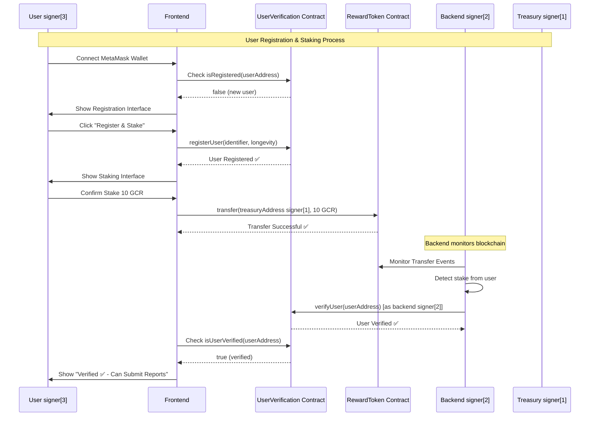
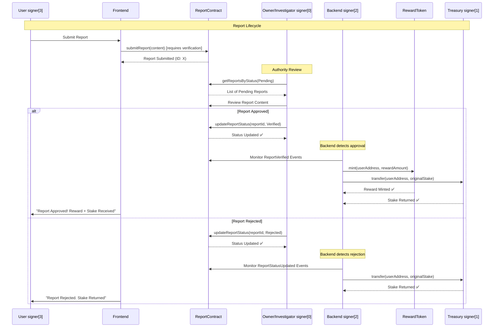

# Stake-Based Verification System Flow

## Complete System Diagram

```mermaid
flowchart TD
    %% User Journey
    A[User Connects MetaMask] --> B{First Time User?}
    B -->|Yes| C[User Registration Flow]
    B -->|No| D{Is User Verified?}
    
    %% Registration & Staking Flow
    C --> C1[Call registerUser() on UserVerification Contract]
    C1 --> C2[Transfer 10 GCR Tokens to Treasury Address signer[1]]
    C2 --> C3[Backend signer[2] Detects Token Transfer]
    C3 --> C4[Backend Auto-calls verifyUser()]
    C4 --> C5[User Now Verified ✅]
    C5 --> E[User Can Submit Reports]
    
    %% Already Registered Flow
    D -->|Yes| E[User Can Submit Reports]
    D -->|No| F[Show Staking Interface]
    F --> C2
    
    %% Report Submission Flow
    E --> G[User signer[3] Submits Report via submitReport()]
    G --> H[Report Stored in ReportContract]
    H --> I[Report Status: Pending]
    
    %% Authority Review Process
    I --> J{Owner/Investigator signer[0] Reviews Report}
    J -->|Approve| K[updateReportStatus() to Verified]
    J -->|Reject| L[updateReportStatus() to Rejected]
    
    %% Reward Distribution
    K --> M[Backend signer[2] Detects Approval]
    M --> N[Mint Reward Tokens to User]
    N --> O[Return Original Stake + Reward]
    
    %% Rejection Flow
    L --> P[Backend signer[2] Detects Rejection]
    P --> Q[Return Original Stake Only]
    
    %% Styling
    classDef userAction fill:#e1f5fe
    classDef contract fill:#f3e5f5
    classDef backend fill:#e8f5e8
    classDef authority fill:#fff3e0
    classDef reward fill:#e8f5e8
    
    class A,B,C,E,F,G userAction
    class C1,C4,G,H,K,L contract
    class C3,M,P backend
    class J authority
    class N,O,Q reward
```

## Detailed User Registration & Staking Flow



## Report Submission & Review Flow



## System Architecture Overview

```mermaid
graph TB
    subgraph "Frontend (React + MetaMask)"
        UI[User Interface]
        WC[Wallet Connection]
        SF[Staking Flow]
        RF[Report Flow]
        VF[View Reports]
    end
    
    subgraph "Backend API (Node.js)"
        AM[Auto-Verification Monitor signer[2]]
        RM[Reward Manager signer[2]]
        EM[Event Monitor signer[2]]
        API[REST API Endpoints]
    end
    
    subgraph "Smart Contracts (Oasis Sapphire)"
        UV[UserVerification Contract]
        RT[RewardToken Contract]
        RC[ReportContract Contract]
    end
    
    subgraph "Wallet Structure"
        OI[Owner/Investigator signer[0]]
        TA[Treasury Address signer[1]]
        BS[Backend Service signer[2]]
        TU[Test User signer[3]]
    end
    
    %% Frontend Connections
    UI --> WC
    WC --> SF
    SF --> RF
    RF --> VF
    
    %% Frontend to Contracts
    SF --> UV
    SF --> RT
    RF --> RC
    VF --> RC
    
    %% Backend Monitoring
    AM --> UV
    AM --> RT
    RM --> RT
    RM --> TA
    EM --> RC
    
    %% API Connections
    UI --> API
    API --> UV
    API --> RC
    
    %% Wallet Assignments
    OI --> UV
    OI --> RC
    TA --> RT
    BS --> AM
    BS --> RM
    TU --> SF
    TU --> RF
    
    %% Styling
    classDef frontend fill:#e3f2fd
    classDef backend fill:#e8f5e8
    classDef contract fill:#f3e5f5
    classDef wallet fill:#fff3e0
    
    class UI,WC,SF,RF,VF frontend
    class AM,RM,EM,API backend
    class UV,RT,RC contract
    class OI,TA,BS,TU wallet
```

## Token Economics Flow

```mermaid
flowchart LR
    subgraph "User Staking"
        A[User signer[3] Has GCR Tokens] --> B[Stakes 10 GCR]
        B --> C[Tokens Sent to Treasury signer[1]]
    end
    
    subgraph "Report Outcomes"
        D[Report Approved by signer[0]] --> E[Backend signer[2] Mints Reward Tokens]
        E --> F[Return Original Stake + Reward]
        
        G[Report Rejected by signer[0]] --> H[Backend signer[2] Returns Original Stake Only]
    end
    
    subgraph "Token Flow"
        C --> I{Report Result}
        I -->|Approved| D
        I -->|Rejected| G
    end
    
    F --> J[User Gains: Stake + Reward]
    H --> K[User Gets: Original Stake Back]
    
    classDef stake fill:#e1f5fe
    classDef reward fill:#e8f5e8
    classDef return fill:#fff3e0
    
    class A,B,C stake
    class D,E,F reward
    class G,H,K return
```

## Optimized 4-Wallet Structure (Localnet Setup)

Based on 5 Hardhat localnet accounts, here's the optimal wallet allocation:

| Wallet | Hardhat Signer | Role | Permissions |
|--------|----------------|------|-------------|
| **Deployer/Owner/Investigator** | `signer[0]` | Deploy + Admin + Investigate | All admin functions + report verification |
| **Treasury Address** | `signer[1]` | Hold Stakes | Receive/return 10 GCR stakes |
| **Backend Service** | `signer[2]` | Automation | Auto-verify users, mint rewards |
| **Test User** | `signer[3]` | Testing | Register, stake, submit reports |
| **Reserve** | `signer[4]` | Additional Testing | Edge cases, multiple users |

## Authority & Permission Matrix

| Role | Register | Verify Users | Submit Reports | View All Reports | Approve Reports | Mint Rewards |
|------|----------|--------------|----------------|------------------|-----------------|--------------|
| **New User** | ✅ | ❌ | ❌ | ❌ | ❌ | ❌ |
| **Staked User** | ✅ | ❌ | ✅ | Own Only | ❌ | ❌ |
| **Owner/Investigator** | ✅ | ✅ | ✅ | ✅ | ✅ | ✅ |
| **Backend Service** | ✅ | ✅ | ❌ | ❌ | ❌ | ✅ |
| **Treasury** | ❌ | ❌ | ❌ | ❌ | ❌ | ❌ |

## Key Benefits of This System

- ✅ **No Contract Changes Required**
- ✅ **Immediate Verification After Staking**
- ✅ **Economic Incentive for Quality Reports**
- ✅ **Automatic Reward Distribution**
- ✅ **Stake Protection (returned if rejected)**
- ✅ **Decentralized Yet Secure**
- ✅ **Optimized for 5-Account Localnet Setup**
- ✅ **Owner/Investigator Merged for Simplicity**
- ✅ **Backend Automation with Dedicated Wallet**

## Implementation with Hardhat Localnet

### Account Setup
```javascript
const [deployer, treasury, backend, testUser, reserve] = await ethers.getSigners();

// deployer = Owner/Investigator (signer[0])
// treasury = Treasury address (signer[1]) 
// backend = Backend service (signer[2])
// testUser = Test user (signer[3])
// reserve = Additional testing (signer[4])
```

### Smart Contract Permissions
- **Deployer** (`signer[0]`): Automatically gets admin + verifier permissions
- **Backend** (`signer[2]`): Needs admin permission to call `verifyUser()`
- **Treasury** (`signer[1]`): Just receives/sends tokens (no special permissions)

### Token Flow Implementation
1. User stakes 10 GCR → Treasury (`signer[1]`)
2. Backend (`signer[2]`) detects stake → Auto-verifies user
3. User submits reports
4. Owner/Investigator (`signer[0]`) reviews → Approves/Rejects
5. Backend (`signer[2]`) distributes rewards based on decision
